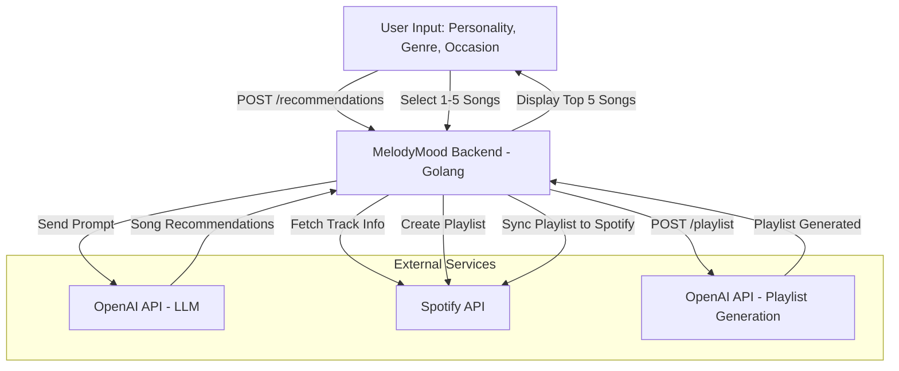

# MelodyMood 🎧✨

MelodyMood is a lightweight, Go-based backend service that delivers AI-powered, personalized song recommendations based on user personality, music taste, and activity context — no data storage required. Ideal for music lovers looking to discover the perfect tunes for any mood or moment.

## 🎯 Features

- 🔮 AI-generated music recommendations powered by OpenAI
- 🎼 Personalized inputs: user personality, preferred genre, and listening occasion
- 🎨 Each song includes:
  - Spotify Track ID
  - Song title
  - Artist name
  - Album art cover
  - Brief reason why it fits the user's vibe
- 📝 User selects 1–5 favorite songs from the list
- 📀 Generates a 20-song playlist based on selected songs
- 🔗 Playlist syncing directly to user's Spotify account
- 🔐 Stateless API — no database or user data persistence

## 🛠 Tech Stack

- **Backend Language**: Go (Golang)
- **AI Model**: OpenAI LLM (via API)
- **Music Provider**: Spotify API (track info + playlist creation)
- **Authentication**: Spotify OAuth (for playlist sync)

## 📊 System Architecture



## 🚀 Getting Started

### Prerequisites

- Go 1.20+
- Spotify Developer account (for API credentials)
- OpenAI API key

### Installation

1. **Clone the repository**

```bash
git clone https://github.com/your-username/melodymood.git
cd melodymood
````

2. **Set environment variables**

Create a `.env` file or export directly:

```env
SPOTIFY_CLIENT_ID=your_spotify_client_id
SPOTIFY_CLIENT_SECRET=your_spotify_client_secret
OPENAI_API_KEY=your_openai_api_key
REDIRECT_URI=http://localhost:8080/callback

APP_ENV=dev
APP_PORT=8080
APP_NAME=melody-mood-service
```

3. **Run the server**, or

```bash
go run main.go
```

4. **Run the server with docker**

```bash
docker-compose up --build
```

5. **Access your app**
Once running, you can access the backend at:

```bash
http://localhost:<APP_PORT>/api/v1
```

## 📦 API Overview

### `POST /recommendations`

**Input**:

```json
{
  "personality": "introverted and chill",
  "genre": "indie rock",
  "occasion": "late night studying"
}
```

**Output**: 5 curated songs with metadata and reasons.

---

### `POST /playlist`

**Input**:

```json
{
  "selected_song_ids": ["spotify_track_id_1", "spotify_track_id_2"]
}
```

**Output**: 20-song playlist recommendation.

---

### `POST /sync`

Triggers Spotify playlist creation based on the latest generated playlist and connects it to the user's account.

## ❌ No Data Storage

MelodyMood is fully stateless. User input is used only during the session to generate song recommendations and playlists — no databases or permanent storage involved.

## 📄 License

MIT License. See `LICENSE` for details.

## ❤️ Credits

Built with love using:

- [Go](https://golang.org/)
- [Spotify Web API](https://developer.spotify.com/documentation/web-api/)
- [OpenAI](https://platform.openai.com/)

---

> 🎶 _MelodyMood – Music that feels you._
