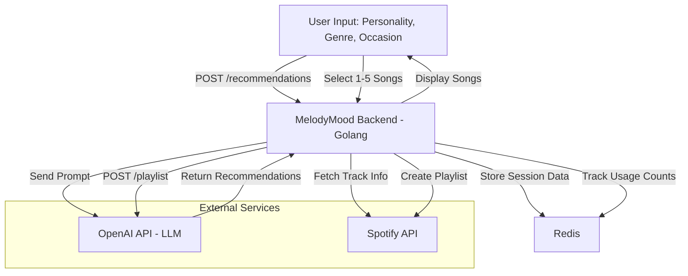

# 🎧 MelodyMood

MelodyMood is a stateless, Golang-powered backend service that generates personalized music recommendations using OpenAI and Spotify APIs. It also uses Redis for caching and tracking usage limits.

---

## 🚀 Features

- 🎯 Personalized music recommendations based on:
  - Personality
  - Favorite music genre
  - Typical listening occasion
- 🤖 AI-generated playlist suggestions (via OpenAI)
- 🎵 Fetch real Spotify tracks and album cover art
- ⚡ Caching recommendations per session (with Redis)
- 🐳 Full Dockerized setup (no manual server installation)
- 🔥 Session-based rate-limiting (e.g., 10 requests/hour)
- 📦 Stateless design — no database needed

---

## 📊 System Architecture



````

---

## 🐳 Running Locally with Docker

### 1. Clone the repository

```bash
git clone https://github.com/your-username/melodymood.git
cd melodymood
````

### 2. Create a `.env` file

```env
OPENAI_API_KEY=your_openai_api_key
SPOTIFY_CLIENT_ID=your_spotify_client_id
SPOTIFY_CLIENT_SECRET=your_spotify_client_secret
REDIRECT_URI=http://localhost:8080/callback
APP_PORT=8080
REDIS_ADDR=redis:6379
```

### 3. Docker Compose Up

```bash
docker-compose up --build
```

This will start:

- MelodyMood Backend
- Redis Server

You can access the backend at:

```
http://localhost:8080
```

---

## 📦 Redis Usage

| Key Format                                  | Purpose                            | TTL     |
| :------------------------------------------ | :--------------------------------- | :------ |
| `session:{session_id}:recommendation_count` | Count of user recommendations      | 1 hour  |
| `session:{session_id}:recommendations`      | Cached recommendations per session | 2 hours |

✅ **`is_regenerate: false`** → Try to serve from Redis cache first  
✅ **`is_regenerate: true`** → Force re-generate from OpenAI and overwrite cache

---

## 📡 API Endpoints

### `POST /api/v1/recommendations`

**Request Body**:

```json
{
  "personality": "calm and introverted",
  "genre": "lo-fi hip hop",
  "occasion": "working late at night",
  "is_regenerate": false
}
```

**Headers**:

- `X-Session-ID: your-unique-session-id`

**Behavior**:

- If `is_regenerate: false`, tries Redis cache first.
- If no cache found, generates new recommendations.
- If `is_regenerate: true`, always generates new and updates cache.

**Response Headers**:

- `X-RateLimit-Remaining: number` — number of allowed requests remaining this hour.

---

## 📄 License

MIT License. See `LICENSE` file.

---

## ❤️ Credits

Built with love using:

- [Go](https://golang.org/)
- [Spotify Web API](https://developer.spotify.com/documentation/web-api/)
- [OpenAI](https://platform.openai.com/)

---

> 🎶 _MelodyMood – Music that feels you._
